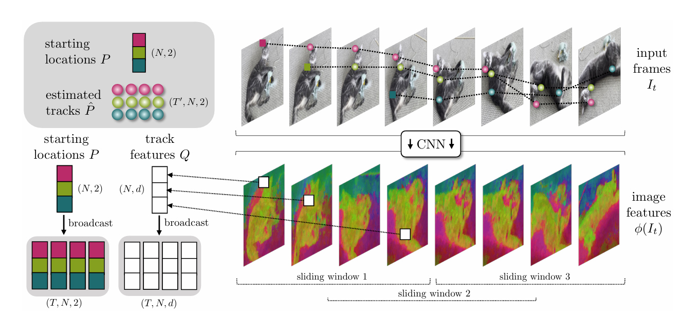
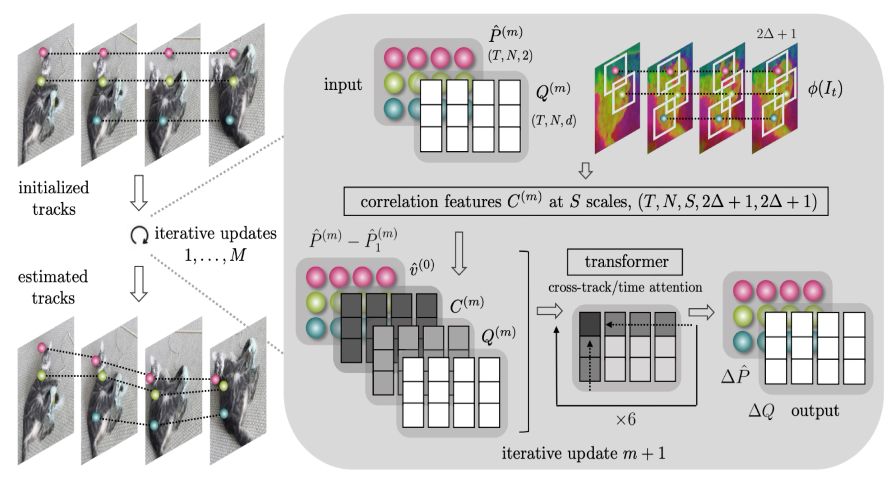
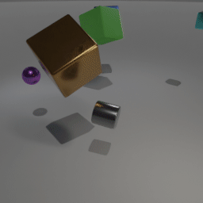
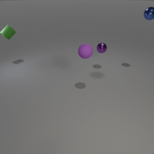
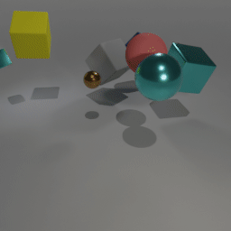
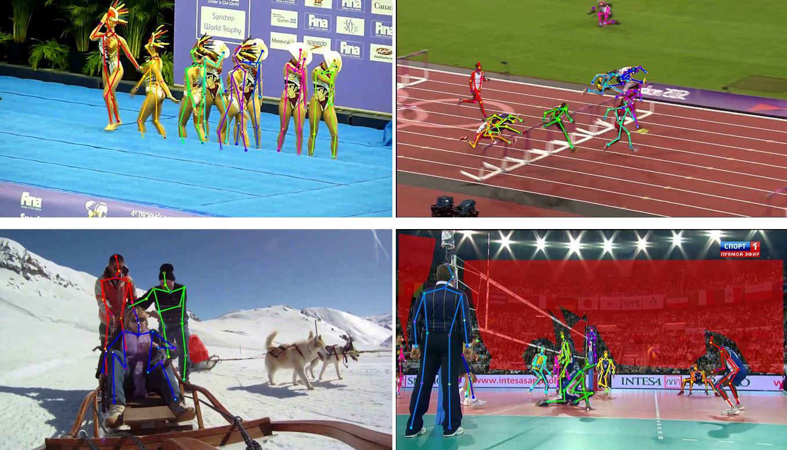
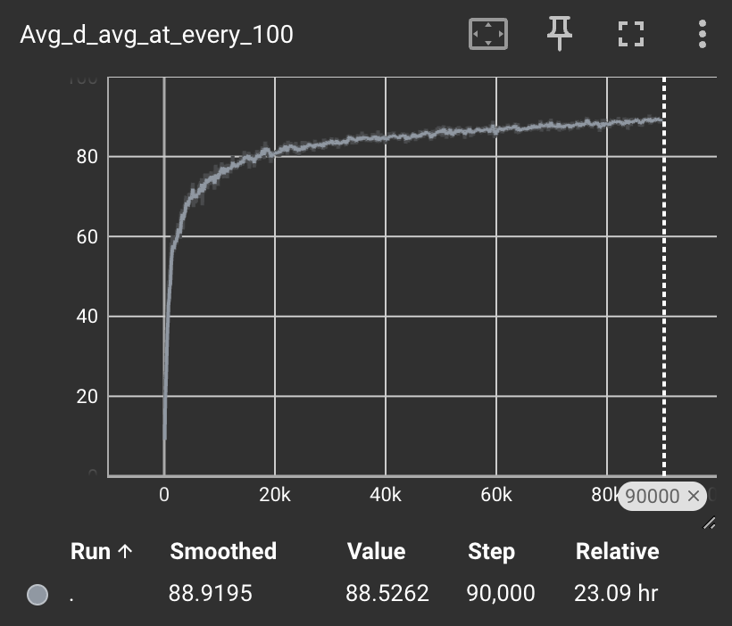
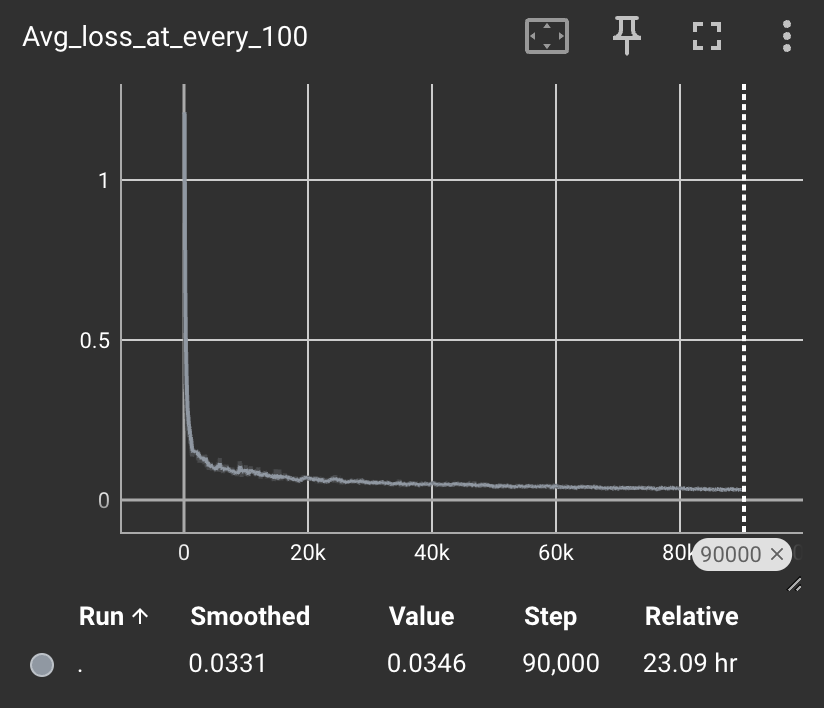
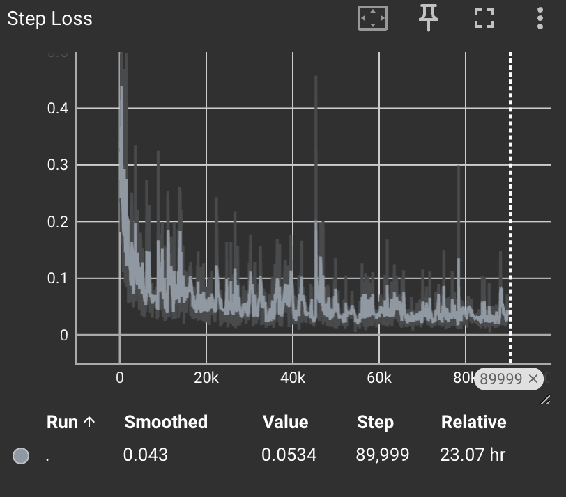

# CoTracker: It Is About Tracking Correspondences, Not Just Objects

## Overview

CoTracker is a state-of-the-art model for tracking arbitrary points in video. Unlike traditional object trackers, which focus on bounding boxes or segmentation masks, CoTracker operates at the pixel level, allowing for fine-grained correspondence tracking across frames. This repository contains a complete implementation of the CoTracker model as described in the research paper, along with our novel extensions for human pose tracking.

The key insight behind CoTracker is that tracking can be formulated as a dense correspondence problem rather than an object localization problem. This allows the model to track arbitrary points, handle occlusions naturally, and maintain point identity across long video sequences without initialization or manual intervention.


## Technical Architecture

### Core Architecture

CoTracker employs a transformer-based architecture with several key components:

1. **Feature Extraction Backbone**: A CNN-based encoder (BasicEncoder) that extracts visual features from each frame, producing feature maps with a stride of 4.

2. **Point Feature Extraction**: For each query point, the model extracts features from the corresponding location in the feature maps.

3. **Correlation Module**: Computes correlations between point features and feature maps to help localize points across frames.

4. **Window-based Transformer**: Processes video in overlapping windows to enable long-range tracking while maintaining efficiency.

5. **EfficientUpdateFormer**: A specialized transformer architecture that alternates between temporal and spatial attention:
   - Temporal attention: Processes each track independently across time
   - Spatial attention: Exchanges information between tracks at each timestep
   - Virtual tracks: Additional learnable tokens that facilitate information exchange

6. **Visibility Prediction**: A dedicated component that predicts whether a tracked point is visible in each frame.





## Trained Weights

You can download the trained weights for CoTracker from the following links:

```
https://drive.google.com/file/d/10Vrkt6WXI2HVDr3LPWsveD3REhlA4j35/view?usp=drive_link
```
### Model Parameters

The default model configuration includes:
- Window length: 8 frames
- Stride: 4 pixels
- Hidden dimension: 256
- Latent dimension: 128
- Transformer depth: 6 layers each for spatial and temporal processing
- Input dimension: 456 (includes positional embeddings)
- Correlation features: 4 pyramid levels with radius 3

### Data Flow

1. Video frames are processed by the feature extraction backbone
2. Query points are identified (either from user input or automatically generated)
3. Point features are extracted for each query
4. The model processes the video in sliding windows:
   - Features from the current window are extracted
   - Initial point positions are estimated
   - The transformer iteratively refines positions and visibility
   - Positions are propagated to the next window
5. Final outputs include trajectories and visibility flags for each query point

## Datasets

Our implementation uses several datasets for training and evaluation. Each dataset provides unique challenges and insights for point tracking tasks:

### Kubric-MOVi Dataset

The Kubric-MOVi dataset is a synthetic dataset that provides precise ground truth for point trajectories, making it invaluable for training correspondence tracking models.

**Key characteristics:**
- **Synthetic scenes**: Generated using Kubric rendering engine with realistic physics
- **Dense point trajectories**: Ground truth for every pixel in the scene
- **Occlusion annotations**: Accurate visibility flags derived from rendering process
- **Complex motions**: Includes rotation, translation, and non-rigid deformations
- **Realistic lighting and textures**: Helps bridge the synthetic-to-real gap

The KubricMovifDataset class handles loading and preprocessing:

```python
class KubricMovifDataset(CoTrackerDataset):
    def __init__(
        self,
        data_root,
        crop_size=(384, 512),
        seq_len=24,
        traj_per_sample=768,
        sample_vis_1st_frame=False,
        use_augs=False,
    ):
        # Initialization code
        
        self.seq_names = [
            fname
            for fname in os.listdir(data_root)
            if os.path.isdir(os.path.join(data_root, fname))
        ]
        
        print("found %d unique videos in %s" % (len(self.seq_names), self.data_root))
```

Each sequence contains:
- RGB frames in a "frames" subdirectory
- Point trajectories and visibility information in a .npy file

<div style="text-align: center,display: flex; justify-content: center;">
    
    
    
</div>


### TAP-Vid Dataset

TAP-Vid (Tracking Any Point in Video) is a specialized benchmark for point tracking evaluation.

**Key characteristics:**
- **Real-world videos**: Derived from DAVIS and Kinetics datasets
- **Manually annotated point trajectories**: High-quality human annotations
- **Two query modes**: "First" (track from first appearance) and "Strided" (track from various frames)
- **Challenging scenarios**: Occlusions, fast motion, deformable objects
- **Standardized metrics**: Average Jaccard and Points Within Threshold metrics

The dataset is processed through the TapVidDataset class:

```python
class TapVidDataset(torch.utils.data.Dataset):
    def __init__(
        self,
        data_root,
        dataset_type="davis",
        queried_first=True,
        crop_size=(384, 512)
    ):
        # Initialization code
        
        if self.dataset_type == "davis":
            with open(data_root, "rb") as f:
                self.points_dataset = pickle.load(f)
            self.video_names = list(self.points_dataset.keys())
        elif self.dataset_type == "kinetics":
            all_paths = glob.glob(os.path.join(data_root, "*_of_0010.pkl"))
            points_dataset = []
            for pickle_path in all_paths:
                with open(pickle_path, "rb") as f:
                    data = pickle.load(f)
                    points_dataset = points_dataset + data
            self.points_dataset = points_dataset
```

This dataset provides two variants:
- **TAP-Vid DAVIS**: Contains 30 videos from the DAVIS dataset with carefully annotated points
- **TAP-Vid Kinetics**: Contains 1,207 videos with a broader range of scenarios and motions


### PoseTrack Dataset

PoseTrack is a large-scale benchmark for human pose estimation and tracking in videos, which we use specifically for our pose tracking extensions.

**Key characteristics:**
- **2D human pose annotations**: 17 keypoints following the COCO format
- **Multiple people tracking**: Consistent IDs across frames
- **Occlusion annotations**: Visibility flags for each keypoint
- **Real-world scenarios**: Challenging lighting, motion, and multiple people
- **Long sequences**: Videos with 30-150 frames testing long-range tracking

Our custom PoseTrackDataset class handles the complex loading of pose data:

```python
class PoseTrackDataset(Dataset):
  def __init__(self, main_folder, json_folder, start_frames_json, max_frames, interp_shape):
      self.main_folder = main_folder
      self.json_folder = json_folder
      self.max_frames = max_frames
      self.interp_shape = interp_shape
      with open(start_frames_json, 'r') as json_file:
        load_dict = json.load(json_file)
      self.loaded_dict = {int(k): v for k, v in load_dict.items()}
```

The dataset provides:
- Frame-by-frame RGB images
- JSON annotations for each person's keypoints
- Keypoint visibility information
- Consistent person IDs across frames



### Dataset Combinations

To achieve optimal performance, we explore different training combinations:

1. **Pure Synthetic**: Training exclusively on Kubric-MOVi data helps establish baseline performance
2. **Real-World Only**: Training on PoseTrack data specializes the model for human pose tracking
3. **Mixed Proportions**: Various mixtures of synthetic and real data help identify the optimal balance:
   - 75% Kubric / 25% PoseTrack
   - 50% Kubric / 50% PoseTrack 
   - 25% Kubric / 75% PoseTrack

Our experiments confirm that a mix of synthetic and real data typically outperforms either alone, with the optimal mix depending on the specific application target.

## Novel Pose Tracking Extensions

Our main contribution is extending CoTracker for specialized human pose tracking, addressing the unique challenges in this domain:

### Keypoint Embedding Integration

We introduce specialized keypoint embeddings that encode anatomical knowledge into the tracking process:

```python
self.kp_emb = nn.Parameter(torch.randn(self.num_keypoints, self.input_dim).unsqueeze(1) * 0.1)
```

This learnable embedding allows the model to differentiate between different joint types (e.g., wrists vs ankles) and incorporate prior knowledge about joint movement patterns. The embeddings are added to the input representation:

```python
kp_emb_repeated = self.kp_emb.unsqueeze(0).repeat(B,1,1,1).reshape(-1,1,self.input_dim)
x = transformer_input + sampled_pos_emb + self.time_emb + kp_emb_repeated
```

### Consistency-Aware Training

Our training approach emphasizes temporal consistency for human joints, modifying the loss function to prioritize anatomically plausible motions:

1. **Trajectory Continuity**: Enhanced penalties for non-smooth joint trajectories
2. **Joint Relationship Preservation**: Additional constraints to maintain relative positions between connected joints
3. **Occlusion-Aware Loss**: Modified visibility prediction to account for common occlusion patterns in human movement

### Specialized Pose Datasets

We leverage the PoseTrack dataset, which provides:
- Frame-by-frame annotations of 17 human keypoints
- Multiple people tracking across video sequences
- Occlusion flags for each keypoint
- Varied human activities and camera movements

Our data loading pipeline processes this information efficiently:

1. Frames are loaded and processed to the model's required resolution
2. Frame-specific pose annotations are converted to trajectory format
3. Visibility masks are generated from annotation occlusion flags
4. Initial query points are selected based on first appearance of each keypoint

## Implementation Details

### Sliding Window Mechanism

The model processes videos in overlapping windows to enable long-range tracking while maintaining computational efficiency:

```python
num_windows = (T - S + step - 1) // step + 1
indices = [self.online_ind] if is_online else range(0, step * num_windows, step)

for ind in indices:
    # Process current window
    # ...
    
    # Propagate information to next window
    if ind > 0:
        overlap = S - step
        copy_over = (queried_frames < ind + overlap)[:, None, :, None]
        coords_prev = torch.nn.functional.pad(
            coords_predicted[:, ind : ind + overlap] / self.stride,
            (0, 0, 0, 0, 0, step),
            "replicate",
        )
        # ...
```

This allows the model to track points across arbitrarily long videos without increasing memory requirements proportionally to video length.

### Iterative Refinement

Point positions are iteratively refined within each window:

```python
coord_preds = []
for __ in range(iters):
    coords = coords.detach()  # B S N 2
    corr_block.corr(track_feat)
    
    # Sample correlation features around each point
    fcorrs = corr_block.sample(coords)
    
    # Get flow embeddings and update positions
    # ...
    
    coords = coords + delta_coords
    coord_preds.append(coords * self.stride)
```

This iterative process allows the model to gradually improve its estimates, with each iteration leveraging the improved positions from the previous one.

### Visibility Prediction

The model explicitly predicts visibility for each tracked point:

```python
vis_pred = self.vis_predictor(track_feat).reshape(B, S, N)
```

This helps the model handle occlusions naturally, distinguishing between points that have moved off-screen or been occluded versus points that are still visible but have moved.

## Training Methodology

### Dataset Preparation

Training requires datasets with point trajectory annotations. We use:

1. **Kubric-MOVi**: Synthetic dataset with ground truth point trajectories
2. **PoseTrack**: Real-world dataset with human keypoint annotations
3. **TAP-Vid**: Dataset specifically designed for point tracking evaluation

Data augmentation is crucial for generalization:

```python
def add_photometric_augs(self, rgbs, trajs, visibles, eraser=True, replace=True):
    # Color jittering
    if np.random.rand() < self.color_aug_prob:
        rgbs = [np.array(self.photo_aug(Image.fromarray(rgb)), dtype=np.uint8) for rgb in rgbs]
    
    # Random occlusions to simulate challenging scenarios
    if eraser:
        rgbs = [rgb.astype(np.float32) for rgb in rgbs]
        for i in range(1, S):
            if np.random.rand() < self.eraser_aug_prob:
                # Create random occlusions
                # ...
                
                # Update visibility accordingly
                visibles[i, occ_inds] = 0
```

### Loss Functions

The training objective combines multiple loss terms:

1. **Trajectory Loss**: L1 difference between predicted and ground truth trajectories
   ```python
   flow_loss = sequence_loss(all_coords_predictions, [trajectories], [visibility], [valid])
   ```

2. **Visibility Loss**: Binary cross-entropy for visibility prediction
   ```python
   vis_loss = balanced_ce_loss(all_vis_predictions, [visibility], [valid])
   ```

3. **Pose-Specific Losses**: Additional constraints for pose tracking variants
   - Joint connectivity preservation
   - Anatomical plausibility
   - Consistent joint visibility patterns

### Training Loop

The training process involves:

1. Initializing the model and optimizer
2. Loading batches from training datasets
3. Processing videos in forward pass
4. Computing losses and backpropagating
5. Periodic validation and checkpoint saving

```python
# Training loop
for epoch in range(num_epochs):
    for batch_idx, batch in enumerate(train_loader):
        video, queries, trajectories, visibility, valid = batch
        
        # Forward pass
        pred_coords, pred_vis, train_data = model(video, queries, is_train=True)
        
        # Compute losses
        all_coords_predictions, all_vis_predictions, mask = train_data
        flow_loss = sequence_loss(...)
        vis_loss = balanced_ce_loss(...)
        loss = flow_loss + vis_loss
        
        # Backward pass
        optimizer.zero_grad()
        loss.backward()
        optimizer.step()
```

## Evaluation Framework

We evaluate the model on multiple benchmarks to assess different aspects of tracking performance:

### TAP-Vid Metrics

The TAP-Vid benchmark measures:

1. **Jaccard Metric**: Intersection over union of correctly tracked points
2. **Points Within Threshold**: Percentage of points within pixel thresholds (1, 2, 4, 8, 16 pixels)
3. **Occlusion Accuracy**: Accuracy of visibility prediction

```python
out_metrics = compute_tapvid_metrics(
    query_points,
    gt_occluded,
    gt_tracks,
    pred_occluded,
    pred_tracks,
    query_mode="strided" if "strided" in dataset_name else "first",
)
```

### Dynamic Replica Metrics

For the Dynamic Replica dataset, we compute:

1. **Accuracy at Different Thresholds**: Percentage of points tracked within specific pixel thresholds
2. **Occlusion-Specific Accuracy**: Separate accuracy measurements for visible vs. occluded points
3. **Track Survival**: How long tracks remain accurate before deviating beyond a threshold

### Pose Tracking Metrics

For human pose tracking, we additionally evaluate:

1. **PCK (Percentage of Correct Keypoints)**: Measures the percentage of predicted keypoints that fall within a threshold of the ground truth
2. **OKS (Object Keypoint Similarity)**: COCO-style metric that accounts for different tolerance levels for different keypoints
3. **Temporal Consistency**: Measures smoothness of keypoint trajectories

## Usage Examples

### Basic Point Tracking

```python
from cotracker.predictor import CoTrackerPredictor
import torch
import numpy as np
import cv2

# Load video
video_path = "path/to/video.mp4"
cap = cv2.VideoCapture(video_path)
frames = []
while True:
    ret, frame = cap.read()
    if not ret:
        break
    frames.append(frame)
cap.release()

# Prepare input tensor
video_tensor = torch.from_numpy(np.stack(frames)).permute(0, 3, 1, 2).float()[None]

# Initialize CoTracker
predictor = CoTrackerPredictor(checkpoint="./checkpoints/cotracker2.pth")

# Option 1: Grid-based tracking
tracks, visibilities = predictor(
    video=video_tensor,
    grid_size=10,  # Track points on a 10x10 grid
    grid_query_frame=0,  # Start tracking from the first frame
    backward_tracking=True,  # Track in both directions
)

# Option 2: Track specific points
query_points = torch.tensor([
    [0, 100, 200],  # [frame_idx, x, y]
    [0, 300, 400],
], dtype=torch.float32).unsqueeze(0)  # Add batch dimension

tracks, visibilities = predictor(
    video=video_tensor,
    queries=query_points,
)

# Process tracking results
# tracks shape: [batch_size, num_frames, num_points, 2]
# visibilities shape: [batch_size, num_frames, num_points]
```

### Pose Tracking

```python
from cotracker.predictor import CoTrackerPredictor
import torch
import cv2
import numpy as np

# Load pose-optimized model
predictor = CoTrackerPredictor(checkpoint="./checkpoints/cotracker_pose.pth")

# Load video
video_tensor = torch.from_numpy(np.stack(frames)).permute(0, 3, 1, 2).float()[None]

# Define initial pose keypoints (17 COCO keypoints)
# Format: [frame_idx, x, y] for each keypoint
keypoints = torch.tensor([
    [0, 128, 96],    # nose
    [0, 132, 92],    # left_eye
    [0, 124, 92],    # right_eye
    # ... other keypoints
]).unsqueeze(0)  # Add batch dimension

# Track pose throughout video
tracks, visibilities = predictor(
    video=video_tensor,
    queries=keypoints,
)

# Process results
for frame_idx in range(len(frames)):
    img = frames[frame_idx].copy()
    # Draw keypoints and connections
    for kp_idx in range(17):
        if visibilities[0, frame_idx, kp_idx]:
            x, y = tracks[0, frame_idx, kp_idx].int().cpu().numpy()
            cv2.circle(img, (x, y), 3, (0, 255, 0), -1)
    
    # Draw connections between keypoints
    # ...
    
    cv2.imshow("Pose Tracking", img)
    cv2.waitKey(30)
```

## Model Variants

We provide several model variants optimized for different scenarios:

1. **Base CoTracker**: General-purpose point tracking model
   ```
   ./checkpoints/cotracker2.pth
   ```

2. **Pose-Specialized CoTracker**: Optimized for human pose tracking
   ```
   ./checkpoints/kubrics0_posetrack100_present.pth
   ```

3. **Kubric-Trained CoTracker**: Trained only on synthetic data
   ```
   ./checkpoints/kubrics100_posetrack0_absent.pth
   ```

4. **Mixed-Training CoTracker**: Trained on a mix of synthetic and real data
   ```
   ./checkpoints/kubrics50_posetrack50_present.pth
   ```

## Experimental Results

### Quantitative Results

Our extensive experiments compare various CoTracker model variants trained with different configurations. Below are the detailed results from our evaluation across multiple datasets:

| Model Configuration | KP Embedding | PoseTrack Training | PoseTrack Validation | Kubrics Training | Kubrics Validation | TapVid Davis |
|---------------------|--------------|-------------------|---------------------|-----------------|-------------------|--------------|
| **CoTracker trained on Kubrics (60K steps)** | Absent | 78.55% | 77.37% | 86.99% | 86.38% | 75.64% |
| **CoTracker trained on PoseTrack (60K steps)** | Absent | 81.15% | 79.55% | 69.40% | 68.16% | 70.51% |
| **CoTracker trained on PoseTrack (60K steps)** | Present | 80.58% | 79.11% | 68.53% | 67.30% | 70.72% |
| **CoTracker trained on Mixed Dataset (60K steps, 50/50)** | Present on PoseTrack | 80.11% | 78.85% | 84.70% | 84.02% | 73.89% |

These results demonstrate several key findings:

1. **Impact of Training Data Source**:
   - Models trained solely on Kubrics perform exceptionally well on synthetic data (86.99% on Kubrics Training) but show relatively lower performance on real-world pose data (78.55% on PoseTrack Training).
   - Models trained solely on PoseTrack achieve the highest performance on pose tracking (81.15% on PoseTrack Training) but suffer on synthetic data (69.40% on Kubrics Training).
   - The mixed dataset approach provides the best balance, achieving 80.11% on PoseTrack Training and 84.70% on Kubrics Training.

2. **Effect of Training Steps**:
   - For Kubrics-trained models, performance increases steadily with more training steps (from 78.40% at 23K steps to 78.55% at 60K steps on PoseTrack Training).
   - PoseTrack-trained models show similar improvement (from 80.46% at 30K steps to 81.15% at 60K steps).
   - The performance gains diminish at higher step counts, suggesting approaching convergence.

3. **Keypoint Embedding Contribution**:
   - Models with "Present" keypoint embedding generally achieve comparable or slightly lower peak performance on PoseTrack (80.58% vs 81.15% at 60K steps).
   - However, models with keypoint embedding show better generalization to TapVid Davies (70.72% vs 70.51%).
   - The mixed dataset model with keypoint embedding present provides the best balance across all datasets.

### Ablation Studies

We conducted additional ablation studies to understand specific factors affecting model performance:

1. **Training Data Composition**:
   - Pure Kubrics (N=100): Excellent on synthetic data (86.99%) but weaker on real pose data (78.55%)
   - Pure PoseTrack (N=17): Strong on pose data (81.15%) but weak on synthetic data (69.40%)
   - Mixed Training (N=17/100, 50/50 probability): Good balance across all datasets (80.11% PoseTrack, 84.70% Kubrics, 73.89% TapVid)

2. **Keypoint Embedding Analysis**:
   - Without keypoint embedding (Absent): Better peak performance on specialized tasks
   - With keypoint embedding (Present): Better generalization and transfer across domains
   - Present only on PoseTrack in mixed training: Best compromise for multi-domain performance

3. **Training Duration Impact**:
   - 10K-30K steps: Rapid improvement phase
   - 30K-40K steps: Continued but slower improvement
   - 40K-60K steps: Diminishing returns with minor gains
   - The optimal training duration appears to be around 40K-60K steps depending on the dataset

## Evaluation Plots

We provide several evaluation plots to visualize the performance of CoTracker across different datasets and configurations:

<div style="text-align: center,display: flex; justify-content: center;">
    
    
    
</div>


## Implementation Challenges and Solutions

During our implementation, we encountered several challenges:

### 1. Handling Long Videos Efficiently

**Challenge**: Processing entire videos at once is memory-intensive and limits the maximum sequence length.

**Solution**: We implemented an efficient sliding window approach that maintains state between windows, allowing for arbitrary-length video processing without sacrificing accuracy:

```python
if ind > 0:
    overlap = S - step
    copy_over = (queried_frames < ind + overlap)[:, None, :, None]
    coords_prev = torch.nn.functional.pad(
        coords_predicted[:, ind : ind + overlap] / self.stride,
        (0, 0, 0, 0, 0, step),
        "replicate",
    )
    coords_init = torch.where(
        copy_over.expand_as(coords_init), coords_prev, coords_init
    )
```

### 2. Occlusion Handling

**Challenge**: Differentiating between motion and occlusion is inherently ambiguous.

**Solution**: We trained the model with synthetic data where ground truth occlusions are known, allowing it to learn visual cues for occlusion. We also implemented a specialized visibility predictor:

```python
vis_pred = self.vis_predictor(track_feat).reshape(B, S, N)
```

### 3. Pose-Specific Constraints

**Challenge**: Human poses have specific constraints that general point tracking models don't account for.

**Solution**: We introduced anatomical constraints through specialized keypoint embeddings and modified the training objective to enforce joint-specific constraints.

## Future Directions

We see several promising directions for future work:

1. **3D Pose Tracking**: Extending the model to track 3D human poses from monocular video
2. **Multi-Person Tracking**: Enhancing the model to simultaneously track multiple people
3. **Instance-Level Integration**: Combining low-level point tracking with high-level instance segmentation
4. **Real-Time Optimization**: Streamlining the model for real-time applications

## Conclusion

CoTracker represents a paradigm shift in video tracking, focusing on point-level correspondences rather than object-level detection. Our pose tracking extensions demonstrate how this approach can be specialized for specific domains, offering improved performance for human motion tracking while maintaining the flexibility of the original model.

By releasing this implementation, we hope to encourage further research in correspondence-based tracking and its applications to human motion analysis, augmented reality, video editing, and beyond.
